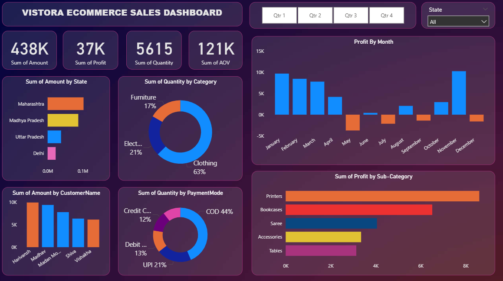

# 📊 Vistora Ecommerce Sales Dashboard — Power BI Project

[](https://powerbi.microsoft.com/)
[](https://www.mysql.com/)
[](https://www.microsoft.com/excel)
[]()

> An end-to-end Business Intelligence project analyzing 1,500+ e-commerce transactions across India. Data was cleaned and transformed using SQL, then visualized in a fully interactive Power BI dashboard with DAX measures, slicers, and drill-down reporting.

---

## 📸 Dashboard Preview



---

## 🎯 Project Objective

To analyze sales performance of a fictional Indian e-commerce brand **Vistora** by building an interactive BI dashboard that helps stakeholders:

- Monitor overall revenue, profit, quantity, and AOV at a glance
- Identify top-performing states, customers, categories, and sub-categories
- Understand monthly profit trends and spot loss-making periods
- Analyze customer payment preferences across product categories
- Filter all insights by Quarter and State dynamically
- 

---

## 📂 Dataset Overview

| File | Records | Columns | Description |
|------|---------|---------|-------------|
| `Orders.csv` | 500 | Order ID, Order Date, Customer Name, State, City | Customer & order metadata |
| `Details.csv` | 1,500 | Order ID, Amount, Profit, Quantity, Category, Sub-Category, Payment Mode | Transaction line items |

### Categories & Sub-Categories
| Category | Sub-Categories |
|----------|---------------|
| **Clothing** (63%) | Saree, Kurta, T-shirt, Shirt, Trousers, Skirt, Leggings, Stole, Accessories, Hankerchief |
| **Electronics** (21%) | Printers, Phones, Electronic Games |
| **Furniture** (17%) | Chairs, Bookcases, Tables, Furnishings |

### States Covered
19 Indian states including Maharashtra, Madhya Pradesh, Uttar Pradesh, Delhi, Rajasthan, Gujarat, Karnataka, and more.

### Payment Modes
COD · UPI · Debit Card · Credit Card · EMI

---

## 🛠️ Tools & Technologies

| Tool | Purpose |
|------|---------|
| **SQL (MySQL)** | Data cleaning, transformation, KPI queries, JOIN, views |
| **Power BI Desktop** | Dashboard creation, DAX measures, visuals, slicers |
| **DAX** | Custom measures — profit margin %, AOV, running totals |
| **Microsoft Excel** | Initial data inspection and validation |
| **VS Code** | SQL query writing and file management |

---

## 🔄 Workflow — How It Was Built

```
Raw CSV Files
     │
     ▼
SQL — Data Cleaning & Transformation
  • Null checks & duplicate detection
  • Whitespace trimming & standardization
  • JOIN Orders + Details → master view
  • Derived columns: Month, Quarter, AOV, Profit Margin %
     │
     ▼
Power BI — Data Modeling & Visualization
  • Imported cleaned view / CSVs
  • Built relationships between tables
  • Created DAX measures
  • Designed interactive dashboard
     │
     ▼
Insights & Reporting
```

---

## 📊 Dashboard Visuals

| Visual | Type | Insight |
|--------|------|---------|
| KPI Cards | Card | Total Revenue (438K), Profit (37K), Quantity (5615), AOV (121K) |
| Profit by Month | Bar Chart | Monthly profit trend — peaks in Jan, Feb, Nov |
| Revenue by State | Bar Chart | Maharashtra leads, followed by Madhya Pradesh |
| Quantity by Category | Donut Chart | Clothing dominates at 63% |
| Quantity by Payment Mode | Donut Chart | COD most preferred at 44% |
| Profit by Sub-Category | Bar Chart | Printers & Bookcases are most profitable |
| Revenue by Customer | Bar Chart | Top 5 customers by spend |
| Quarter Filter | Slicer | Filter all visuals by Qtr 1–4 |
| State Filter | Dropdown | Filter all visuals by State |

---

## 📈 Key Insights

- 💰 **Total Revenue** of ₹4.38 Lakh generated from 500 orders across India
- 📉 **Loss months** — certain mid-year months (June–September) show negative profit, suggesting seasonal dip or discount-heavy periods
- 👕 **Clothing** is the highest volume category (63%) but **Electronics** — especially Printers — drives the most profit
- 🗺️ **Maharashtra** is the top revenue-generating state, followed by Madhya Pradesh
- 💳 **COD remains dominant** (44%) — suggests opportunity to incentivize digital payments
- 🖨️ **Printers & Bookcases** are the most profitable sub-categories despite lower volume
- 👤 Top customers — Harivansh, Madhav, Madan Mohan — contribute significantly to revenue

---

## 🧹 SQL — Data Cleaning Steps

All cleaning and transformation steps are documented in [`ecommerce_analysis.sql`](ecommerce_analysis.sql). Key steps:

1. **Null & missing value checks** across both tables
2. **Whitespace trimming** on State and City fields
3. **Payment mode standardization** — consistent casing
4. **Duplicate detection** on Order IDs
5. **Negative/zero value removal** for quantity and amount
6. **JOIN** Orders + Details into a unified master view
7. **Derived columns** — Month, Quarter, Year, AOV, Profit Margin %
8. **Orphan record check** — ensuring all detail records have a matching order
9. **Sanity check** — final totals validated against dashboard KPI values

---

## ⚙️ How to Run This Project

###  Power BI Template
1. Download `VistoraEcommerceDashboard.pbit`
2. Open in **Power BI Desktop**
3. Point the data source to `Orders.csv` and `Details.csv`
4. Refresh — the dashboard loads automatically

---

## 🎓 What I Learned

- Writing **multi-table SQL JOINs** and creating reusable **views** for BI consumption
- Using **window functions** (`RANK()`, `PERCENTILE_CONT()`, `SUM() OVER()`) for advanced analytics
- Building **DAX measures** in Power BI for dynamic KPI calculations
- Designing a **dark-themed dashboard** with consistent color coding per category
- Implementing **cross-visual filtering** with slicers for Quarter and State
- Identifying **business insights** from raw transactional data — not just visualizing, but interpreting

---

## 👨‍💻 Author

**Sumit Ganesh Deshmukh**
📧 sumitganeshdeshmukh1220@gmail.com
🔗 [LinkedIn](https://www.linkedin.com/in/sumitganeshdeshmukh)
🐙 [GitHub](https://github.com/SumitDeshmukh1220)

---

<div align="center">
  <p>Built with 📊 Power BI · 🛢️ SQL · ☕ lots of curiosity</p>
  <p>© 2026 Sumit Deshmukh</p>
</div>
